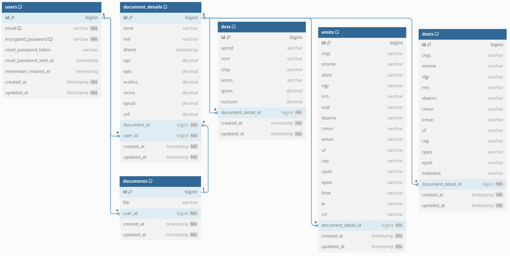

# Maino XML Processor

  [![Ruby][ruby-shield]][ruby-url]
  [![Rails][rails-shield]][rails-url]
  [![Postgres][postgres-shield]][postgres-url]
  [![Redis][redis-shield]][redis-url]
  [![Sidekiq][sidekiq-shield]][sidekiq-url]
  [![AWS S3][s3-shield]][s3-url]

Maino XML Processor é uma aplicação web desenvolvida em Ruby on Rails para o processamento de documentos XML. A aplicação inclui autenticação de usuários, upload e processamento de arquivos XML em background, geração de relatórios detalhados com filtros, e exportação desses relatórios em Excel.

## Funcionalidades

- **Autenticação de Usuários**: Gerenciada pelo Devise.
- **Upload de XML**: Permite o upload de arquivos XML ou ZIP contendo arquivos XML e os processa em background usando Sidekiq.
- **Processamento em Background**: Os arquivos são processados em jobs background para garantir performance e escalabilidade.
- **Geração de Relatórios**: Relatórios detalhados são gerados a partir dos dados extraídos dos XMLs.
- **Filtros**: Filtros avançados para encontrar relatórios específicos com base nos dados dos documentos XML.
- **Exportação de Relatórios**: Relatórios podem ser exportados em formato Excel (.xls) e, em caso de múltiplos arquivos, em um .zip contendo todos os .xls.
- **Internacionalização (I18n)**: Suporte a múltiplos idiomas.
- **Integração com Active Storage**: Utilizado para gerenciar uploads e armazenamento de arquivos no S3.
- **Testes Automatizados**: Implementados utilizando RSpec.

## Diagrama do Banco de Dados




## Acesso à Aplicação

A aplicação está disponível para testes no seguinte link:

[Maino XML Processor - Deploy](https://maino-xml-processor.fly.dev)


## Tecnologias utilizadas

- Ruby 3.x
- Rails 7.x
- PostgreSQL
- Redis
- Sidekiq
- Active Storage
- Devise
- RSpec
- Tailwind
- Docker
- Amazon S3 (armazenamento de arquivos em nuvem)
- Render (deploy da aplicação)

## Executando a Aplicação

Para rodar a aplicação localmente utilizando Docker e Sidekiq, siga os seguintes passos:

1. Clone o repositório:

    ```bash
    git clone https://github.com/FelipeSoller/maino_xml_processor.git
    cd maino_xml_processor
    ```

2. **Suba os containers do Redis e PostgreSQL**:

   No primeiro terminal, execute o comando:
   ```bash
   docker-compose up
   ```

3. **Inicie o servidor Rails**:

   No segundo terminal, execute:
   ```bash
   bundle install
   rails db:create db:migrate
   bin/dev
   ```

4. **Inicie o Sidekiq**:

   No terceiro terminal, execute:
   ```bash
   bundle exec sidekiq
   ```

Agora, a aplicação estará rodando localmente com Redis, PostgreSQL e Sidekiq configurados corretamente.

## Testes

1. Os testes automatizados estão implementados com RSpec. Para rodá-los:

    ```bash
    bundle exec rspec
    ```
## Entre em contato

[![LinkedIn][linkedin-shield]][linkedin-url]
[![Email][email-shield]][email-url]

<!-- MARKDOWN LINKS & IMAGES -->
[ruby-shield]: https://img.shields.io/badge/Ruby-CC342D?style=for-the-badge&logo=ruby&logoColor=white
[ruby-url]: https://www.ruby-lang.org/en/
[rails-shield]: https://img.shields.io/badge/Rails-CC0000?style=for-the-badge&logo=rubyonrails&logoColor=white
[rails-url]: https://rubyonrails.org/
[postgres-shield]: https://img.shields.io/badge/PostgreSQL-316192?style=for-the-badge&logo=postgresql&logoColor=white
[postgres-url]: https://www.postgresql.org/
[redis-shield]: https://img.shields.io/badge/Redis-DC382D?style=for-the-badge&logo=redis&logoColor=white
[redis-url]: https://redis.io/
[sidekiq-shield]: https://img.shields.io/badge/Sidekiq-DC382D?style=for-the-badge&logo=sidekiq&logoColor=white
[sidekiq-url]: https://sidekiq.org/
[s3-shield]: https://img.shields.io/badge/Amazon_S3-569A31?style=for-the-badge&logo=amazons3&logoColor=white
[s3-url]: https://aws.amazon.com/s3/

<!-- Badges de contato -->
[linkedin-shield]: https://img.shields.io/badge/LinkedIn-0A66C2?style=for-the-badge&logo=linkedin&logoColor=white
[linkedin-url]: https://www.linkedin.com/in/felipesoller/
[email-shield]: https://img.shields.io/badge/Email-D14836?style=for-the-badge&logo=gmail&logoColor=white
[email-url]: mailto:soller@outlook.com